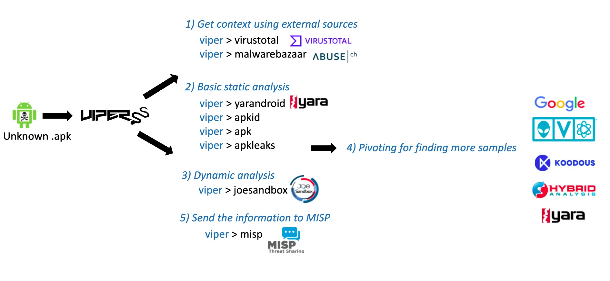
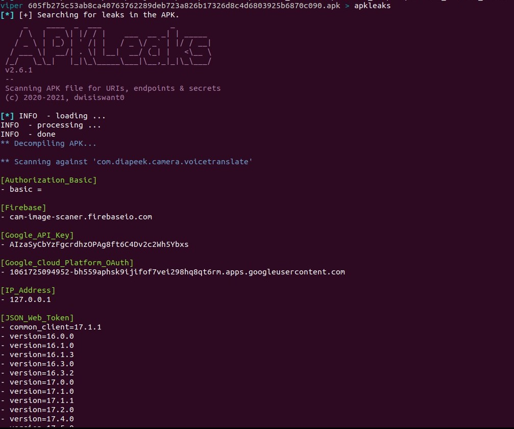
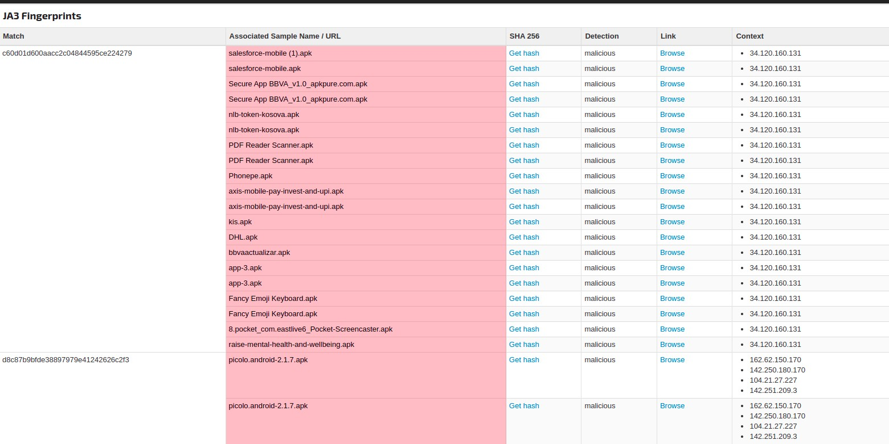

# Viper plugins for triaging Security and Privacy threats on Android applications.

## Introduction
[Viper](https://github.com/viper-framework) is a binary
analysis and management framework developed by [Claudio Guarnieri](https://twitter.com/botherder) aka Nex. 
The aim of Viper is to provide an easy solution for organising malware and exploit samples.
Viper also makes it easy to integrate your collection of scripts via Viper modules. 

This repository contains viper modules for helping threat intelligence analysts 
to triage android applications and to complement other viper modules that can be
used for .apk files such as apk, virustotal or joe among others.


## Modules
This repository contains the following viper modules:

* **apkid**: This module runs APKiD for finding more information about how an APK was made.
 Similar to [PEiD](https://www.aldeid.com/wiki/PEiD) but for Android
* **apkleaks**: This module run [apkleaks](https://github.com/dwisiswant0/apkleaks) for finding potential interesting 
strings.
* **malwarebazaar**: This module makes a request with the md5 of the apk to [MalwareBazaar](https://bazaar.abuse.ch/) 
API.
* **yarandroid**: This module decompresses the apk using [apktool](https://ibotpeaches.github.io/Apktool/), and it runs 
your collection of Yara rules over the files decompressed.

## Workflow

The following image shows the approach for triaging malicious android applications using viper.



Open the suspicious.apk

```bash
viper > open -f suspicious.apk
```

### 1. Context
The first step is to check if there is any match on VirusTotal or MalwareBazaar.

Let's check out VirusTotal results.

```bash
viper 605fb275c53ab8ca40763762289deb723a826b17326d8c4d6803925b6870c090.apk > virustotal
```


Checking out malwarebazaar results.

```bash
viper 605fb275c53ab8ca40763762289deb723a826b17326d8c4d6803925b6870c090.apk > malwarebazaar
```


At this step, we already know that the Android application is malicious and MalwareBazaar
has classified the malicious file as a Joker sample.


### 2. Basic static analysis

We go ahead performing some basic static analysis. We could run our yara rules to check
if there is any match.

```bash
viper 605fb275c53ab8ca40763762289deb723a826b17326d8c4d6803925b6870c090.apk > yarandroid --rules /path/to/your_rules/index_rules.yar
```


Yara returns several hits, including the libjiagu packer. This information could be useful in case
of needing to unpack the sample.

After running Yara, we will check how the APK is made. We will use apkid which is able to identify many compilers, 
packers and obfuscators.

```bash
viper 605fb275c53ab8ca40763762289deb723a826b17326d8c4d6803925b6870c090.apk > apkid
```


Apkid confirms what we already know, the apk is suspicious. If an app has been compiled with dexlib(using smali) it 
probably has been tampered. Besides it also has identified the packer.


Developers have the source code of the app, therefore they shouldn't need
to use smali for making changes in the app. Apkid can also be helpful in detecting the packer and looking for a way of 
unpacking the malicious code.

Now we will check basic info about the app, such as the permissions used or the intents and receivers declared in the 
manifest of the application.

```bash
viper 605fb275c53ab8ca40763762289deb723a826b17326d8c4d6803925b6870c090.apk > apk --all
```


We will also check information about the certificate used by the developer.

```bash
viper 605fb275c53ab8ca40763762289deb723a826b17326d8c4d6803925b6870c090.apk > apk --cert
```

The apk module can also grab the URLs that are hard-coded in the application, but in this case, it
doesn't find anything, probably due to the application is packed.

```bash
viper 605fb275c53ab8ca40763762289deb723a826b17326d8c4d6803925b6870c090.apk > apk --url
```


Finally, we will use apkleaks, which scans the apk in order to find URIs, secrets and endpoints.
```bash
viper 605fb275c53ab8ca40763762289deb723a826b17326d8c4d6803925b6870c090.apk > apkleaks
```



Before starting the dynamic analysis, we will check if the URLs and other interesting strings
are relevant enough to be an IoC. They may be used for detection and also for hunting at step 4.

### 3. Dynamic analysis

In this step, we will analyse the behaviour of the apk using Joe Sandbox. Viper provides a
plugin for interacting with the Joe Sandbox. The syntax is very straightforward.

Using the --submit option the opened sample will be sent to Joe Sandbox for analysis.

```bash
viper 605fb275c53ab8ca40763762289deb723a826b17326d8c4d6803925b6870c090.apk > joe --submit
```

We can check the status of the analysis using the --task option.
```bash
viper 605fb275c53ab8ca40763762289deb723a826b17326d8c4d6803925b6870c090.apk > joe --tasks
```


Finally, once the analysis is complete, we will get the Joe Sandbox report using the
--report option.

```bash
viper 605fb275c53ab8ca40763762289deb723a826b17326d8c4d6803925b6870c090.apk> joe --report
```


### 4. Pivoting for finding more samples.

At this step, we know quite enough about this sample and the next step is to find more samples
related to this campaign. To achieve this, we will:

* Look for hashes and fuzzy hashes in Google and Threat Intelligence platforms such as OTX, etc.
* Look for interesting strings (URLs, tokens, cert, API Keys, etc) in Google and platforms such as OTX ,VT 
or Hybrid Analysis.
* Create Yara rules with the relevant strings found and upload them to platforms such as Koodous,
VT or Hybrid analysis.

For instance, in step 2, we spotted a few interesting strings that could help to find more samples. 
```bash
viper 605fb275c53ab8ca40763762289deb723a826b17326d8c4d6803925b6870c090.apk > apkleaks
```


After looking for the Google API-Key we found a Joe Sandbox report containing the same string.


The report shows that the sample of the report(5ddd08e8723cde7af7a958d81b75fb07) is also a joker
sample and at the bottom part of the report, we can find more samples that are using the same 
C&C that the sample that we are analysing. 


There are also more samples using the same [JA3 fingerprint](https://github.com/salesforce/ja3).





### 5. Send info to MISP

```bash
viper 605fb275c53ab8ca40763762289deb723a826b17326d8c4d6803925b6870c090.apk > misp create_event --info "joker campaign"
```
```bash
viper 605fb275c53ab8ca40763762289deb723a826b17326d8c4d6803925b6870c090.apk > misp add_hashes
```

The event has been created on MISP, and we can go ahead and add some attributes with the viper cli
or just go to the MISP web, and add some attributes manually. We can also add the hashes of the samples discovered
in step 4.